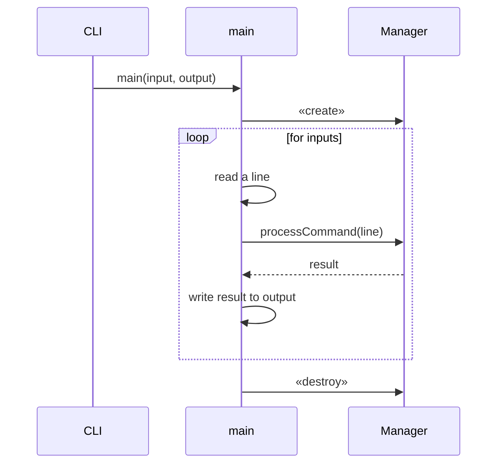
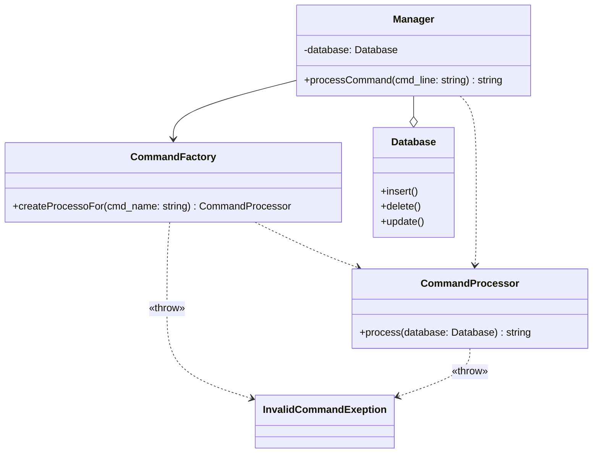
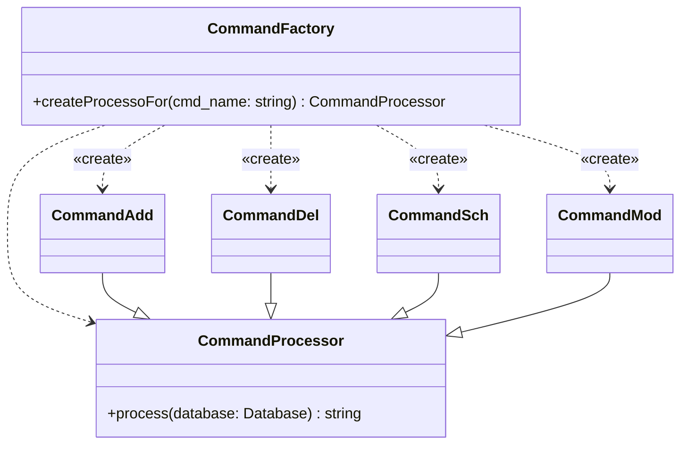
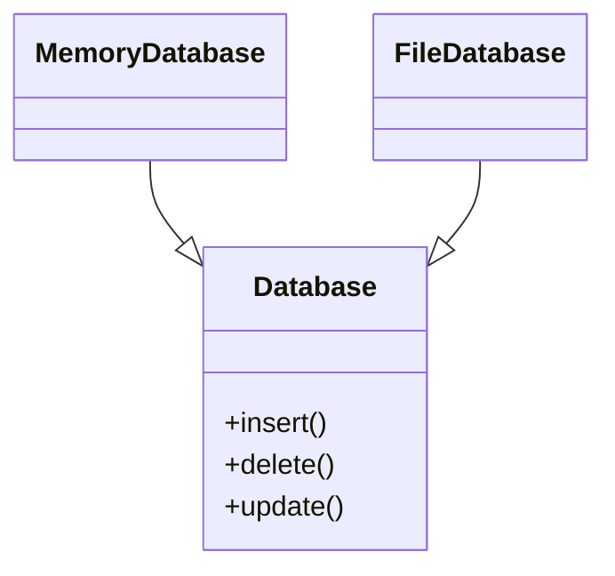

# Sequence diagram : main

# Class diagram

 * Manager: 관리 시스템 메인, 명령어를 받아 CommandFactory로부터 CommandProcessor를 생성하여 실행한다.
 * CommandFactory: CommandProcessor 를 생성한다.
 * CommandProcessor: CommandXxx의 supper class.
 * InvalidCommandException: CommandProcessor에서 처리가 불가할 때 발생하는 오류

